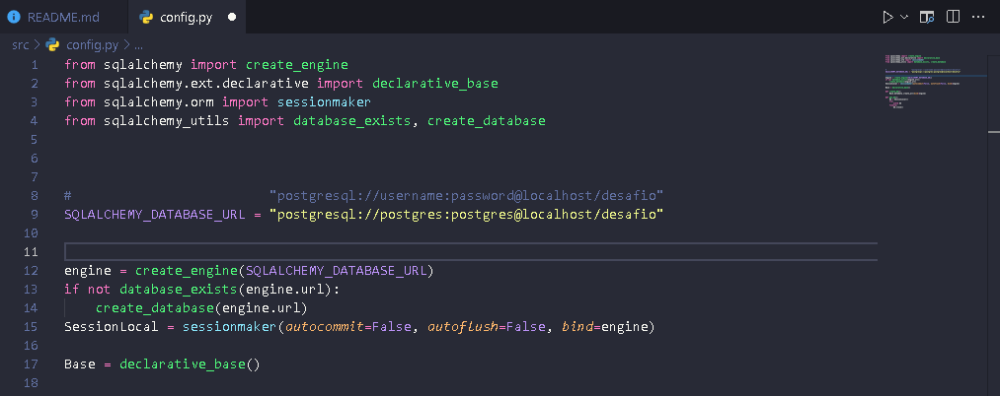

<p align="center">
  
</p>

## 📋 Índice

- [Preview](#-Preview)
- [Sobre](#-Sobre)
- [Tecnologias utilizadas](#-Tecnologias-utilizadas)
- [Como executar o projeto](#-Como-executar-o-projeto)


---

## 🖥 Preview 

<p align="center">
  
  
  
</p>

---

## 📖 Sobre 

A proposta do desafio é uma aplicação simples que possa:
- Cadastrar novas pessoas 
- Editar um cadastro, 
- Apagar um cadastro, 
- Listar o cadastro pelo ID 
- Listar todos os cadastrados

--- 

## 🚀 Tecnologias utilizadas

O projeto está desenvolvido utilizando as seguintes tecnologias:

- Python
- FastAPI
- SQLAlchemy
- PostgreSQL

--- 

## ⌨ Como executar o projeto

```sh
# clone o repositório
git clone https://github.com/JoshuelNobre/lapisco-challenge.git

# entre no diretório
cd lapisco-challenge
```

### Ambiente virtual

- Crie um ambiente virtual de sua prefência, no meu caso utilizei virtualenv.

```shell
# criando ambiente virtual
virtualenv venv

# ative o ambiente virtual, no Windows ativo da seguinte forma
.\venv\Scripts\activate.ps1
# ou
.\venv\Scripts\activate.bat
```

### É necessário ter PostgreSQL em sua máquina, e configurar seu usuário e senha PostgreSQL no arquivo config.py, como mostra na imagem a seguir:
#### obs: O correto seria utilizar dotenv para ocultar dados sensíveis como seu usuário e senha do postgres
<p align="center">
  
</p>

### Executando o projeto
```shell
# instale todas as dependências com
pip install -r requirements.txt

# execute usando o comando
uvicorn src.main:app
```

Feito isso, abra o seu navegador e acesse `http://localhost:8000/docs`

---


Desenvolvido por Joshuel Nobre 🚀